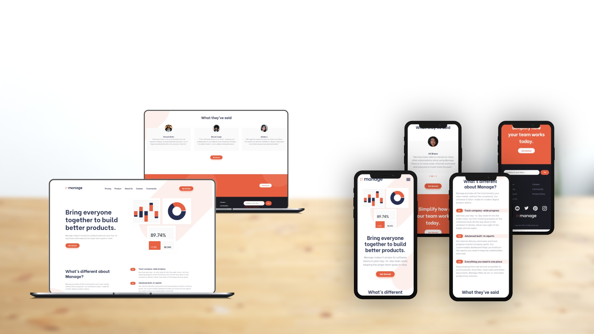

# Manage landing page

This is a solution to the [Manage landing page challenge on Frontend Mentor](https://www.frontendmentor.io/challenges/manage-landing-page-SLXqC6P5). Frontend Mentor challenges help you improve your coding skills by building realistic projects. 

## Table of contents

- [Manage landing page](#manage-landing-page)
  - [Table of contents](#table-of-contents)
  - [Overview](#overview)
    - [The challenge](#the-challenge)
    - [Screenshot](#screenshot)
    - [Links](#links)
  - [Front-end Style Guide](#front-end-style-guide)
    - [Layout](#layout)
    - [Colors](#colors)
    - [Typography](#typography)
    - [Font](#font)
  - [My process](#my-process)
    - [Built with](#built-with)
  - [Author](#author)

## Overview

### The challenge

Users should be able to:

- View the optimal layout for the site depending on their device's screen size
- See hover states for all interactive elements on the page
- See all testimonials in a horizontal slider
- Receive an error message when the newsletter sign up `form` is submitted if:
  - The `input` field is empty
  - The email address is not formatted correctly

### Screenshot

### Links

- Live Site URL: [https://benjaminvillatte.github.io/fem-manage-landing-page/](https://benjaminvillatte.github.io/fem-manage-landing-page/)

## Front-end Style Guide

### Layout

The designs were created to the following widths:

- Mobile: 375px
- Desktop: 1440px

### Colors

_Primary_

Bright Red: hsl(12, 88%, 59%)
Dark Blue: hsl(228, 39%, 23%)

_Neutral_

Dark Grayish Blue: hsl(227, 12%, 61%)
Very Dark Blue: hsl(233, 12%, 13%)
Very Pale Red: hsl(13, 100%, 96%)
Vary Light Gray: hsl(0, 0%, 98%)

### Typography

- Font size: 16px

### Font

- Family: [Be Vietnam](https://fonts.google.com/specimen/Be+Vietnam)
- Weights: 400, 500, 700

## My process

### Built with

- Semantic HTML5 markup
- CSS custom properties
- Flexbox
- Mobile-first workflow

## Author

- Website - [Benjamin VILLATTE](https://benjaminvillatte.fr)

